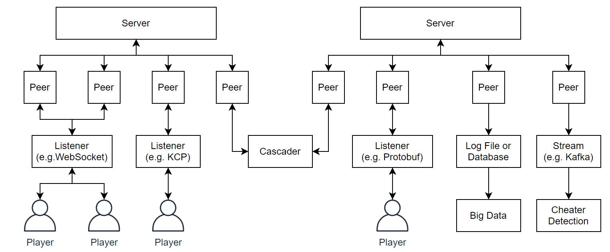

# Rua!

> [English README](#english)

一个简单的、高度可定制化的游戏服务器框架，基于[Go语言](https://golang.org/)编写。



## 特性

- 支持的服务器类型：
  - [帧同步(lockstep)服务器](https://github.com/DiscreteTom/rua/blob/main/lockstep.go)
    - 支持根据延迟动态调节步长
  - [FIFO事件驱动服务器](https://github.com/DiscreteTom/rua/blob/main/eventdriven.go)
  - 自定义服务器，只要实现了[`rua.GameServer`](https://github.com/DiscreteTom/rua/blob/main/model.go)接口即可
- 支持的Peer：
  - 用来debug:
    - [`StdioPeer`](https://github.com/DiscreteTom/rua/blob/main/peers/debug/stdio.go)
  - 用来持久化（用来大数据分析/战斗回放）：
    - [`FilePeer`](https://github.com/DiscreteTom/rua/blob/main/peers/persistent/file.go)
  - 用来实现客户端服务器通信：
    - [`NetPeer`](https://github.com/DiscreteTom/rua/blob/main/peers/network/net.go)
    - [plugin/`KcpPeer`](https://github.com/DiscreteTom/rua/tree/main/plugin/network/kcp)
    - [plugin/`WebsocketPeer`](https://github.com/DiscreteTom/rua/tree/main/plugin/network/websocket)
  - 用来实现流式输出数据（用来异步检测外挂）：
    - [plugin/`KinesisPeer`](https://github.com/DiscreteTom/rua/tree/main/plugin/stream/kinesis)
  - 自定义Peer，只要实现了[`rua.Peer`](https://github.com/DiscreteTom/rua/blob/main/model.go)接口即可
- 事件驱动编程风格
- 级联架构
- 标记Peer

## 安装

安装服务器本体

```bash
go get github.com/DiscreteTom/rua
```

安装插件（以[websocket](https://github.com/DiscreteTom/rua/tree/main/plugin/network/websocket)为例）

```bash
go get github.com/DiscreteTom/rua/plugin/network/websocket
```

## 入门

> 运行此示例代码需要安装[websocket插件](https://github.com/DiscreteTom/rua/tree/main/plugin/network/websocket)

```go
package main

import (
	"github.com/DiscreteTom/rua"
	"github.com/DiscreteTom/rua/plugin/network/websocket"
)

func main() {
	s := rua.NewEventDrivenServer().
		SetHandleKeyboardInterrupt(true).
		OnPeerMsg(func(msg *rua.PeerMsg, s *rua.EventDrivenServer) {
			// broadcast to everyone
			for _, p := range s.GetPeers() {
				go p.Write(msg.Data)
			}
		})

	// start websocket listener, which will generate peer to the game server
	go websocket.NewWebsocketListener(":8080", s).Start()

	// start event driven game server
	s.Start()
}
```

## 更多示例

- [基本示例](https://github.com/DiscreteTom/rua/tree/main/example)
- [Websocket](https://github.com/DiscreteTom/rua/tree/main/plugin/network/websocket/_example)
- [KCP](https://github.com/DiscreteTom/rua/tree/main/plugin/network/kcp/_example)

## [日志](https://github.com/DiscreteTom/rua/blob/main/logger.go)

- rua自身提供了默认的logger，可以使用`rua.GetDefaultLogger()`来获取它，或者使用`rua.SetDefaultLogger`来覆盖它
  - 比如使用`rua.SetDefaultLogger(rua.NewDefaultLogger().WithLevel(rua.DEBUG))`来设置日志等级
- 您也可以使用您喜欢的logger，比如使用logrus，只要它实现了`rua.Logger`接口
  - `rua.SetDefaultLogger(logrus.New())`
- 您也可以使用`rua.NewBasicLogger`、`rua.NewBasicSimpleLogger`这两个helper函数，快速构建自定义的logger

## TODO

- [ ] KCP + smux

# English

Rua is a simple, highly customizable game server framework written with [golang](https://golang.org/).


## Features

- Supported server types:
  - [Lockstep server](https://github.com/DiscreteTom/rua/blob/main/lockstep.go).
    - The step length can be changed dynamically.
  - [Event driven server](https://github.com/DiscreteTom/rua/blob/main/eventdriven.go).
  - Any custom server implements the interface [`rua.GameServer`](https://github.com/DiscreteTom/rua/blob/main/model.go).
- Supported peers:
  - For debug:
    - [`StdioPeer`](https://github.com/DiscreteTom/rua/blob/main/peers/debug/stdio.go)
  - For persistent (for big data analysis and battle replay):
    - [`FilePeer`](https://github.com/DiscreteTom/rua/blob/main/peers/persistent/file.go)
  - For game client connectivity:
    - [`NetPeer`](https://github.com/DiscreteTom/rua/blob/main/peers/network/net.go)
    - [plugin/`KcpPeer`](https://github.com/DiscreteTom/rua/tree/main/plugin/network/kcphttps://github.com/DiscreteTom/rua/tree/main/plugin/network/kcp)
    - [plugin/`WebsocketPeer`](https://github.com/DiscreteTom/rua/tree/main/plugin/network/websocket)
  - For streaming data (for async cheater detection):
    - [plugin/`KinesisPeer`](https://github.com/DiscreteTom/rua/tree/main/plugin/stream/kinesis)
  - Any custom peer implements the interface [`rua.Peer`](https://github.com/DiscreteTom/rua/blob/main/model.go).
- Event-driven style coding.
- Cascade architecture.
- Peer tagging.

## Installation

Install the rua server itself:

```bash
go get github.com/DiscreteTom/rua
```

Install plugins (e.g. [websocket](https://github.com/DiscreteTom/rua/tree/main/plugin/network/websocket)):

```bash
go get github.com/DiscreteTom/rua/plugin/network/websocket
```

## Getting Started

> This example requires the [websocket plugin](https://github.com/DiscreteTom/rua/tree/main/plugin/network/websocket).

```go
package main

import (
	"github.com/DiscreteTom/rua"
	"github.com/DiscreteTom/rua/plugin/network/websocket"
)

func main() {
	s := rua.NewEventDrivenServer().
		SetHandleKeyboardInterrupt(true).
		OnPeerMsg(func(msg *rua.PeerMsg, s *rua.EventDrivenServer) {
			// broadcast to everyone
			for _, p := range s.GetPeers() {
				go p.Write(msg.Data)
			}
		})

	// start websocket listener, which will generate peer to the game server
	go websocket.NewWebsocketListener(":8080", s).Start()

	// start event driven game server
	s.Start()
}
```

## More Examples

- [Basics](https://github.com/DiscreteTom/rua/tree/main/example)
- [Websocket](https://github.com/DiscreteTom/rua/tree/main/plugin/network/websocket/_example)
- [KCP](https://github.com/DiscreteTom/rua/tree/main/plugin/network/kcp/_example)

## [Logging](https://github.com/DiscreteTom/rua/blob/main/logger.go)

- Rua provide a default logger, you can use `rua.GetDefaultLogger` to get it, or use `rua.SetDefaultLogger` to override it.
  - E.g. you can use `rua.SetDefaultLogger(rua.NewDefaultLogger().WithLevel(rua.DEBUG))` to set log level.
- You can also use your favorite logger like logrus as long as it implements the interface `rua.Logger`.
  - `rua.SetDefaultLogger(logrus.New())`
- You can use these two helper function `rua.NewBasicLogger` & `rua.NewBasicSimpleLogger` to build your own logger quickly.

## TODO

- [ ] KCP + smux